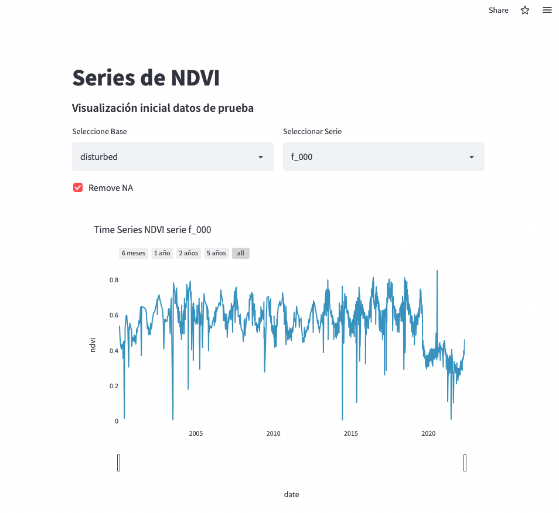

## Visualizador de Series de Tiempo de NDVI

Corresponde a registros del promedio NDVI (Landsat 8) de parcelas bosque esclerofilo de la zona Central de Chile, por el periodo que desde 2000-01-03 a 2022-04-29.

